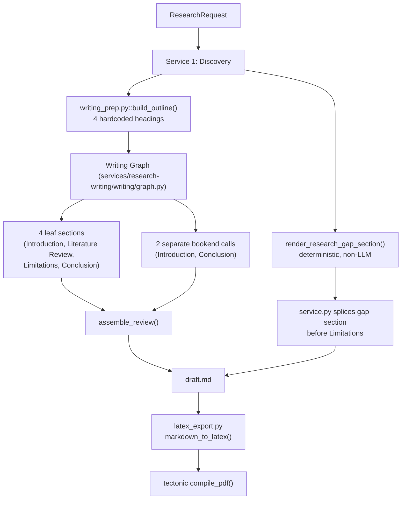

# 📌 ResearchGenie Paper Output Diagnostic

**Date:** 2026-08-28
**Status:** Diagnostic only — no fixes applied. All findings below are traced to real code and measured against real, already-completed pipeline runs (`outputs/`, mirrored in `docs/research-papers/`).

---

## 📖 Index

1. [🎯 Problem Observed](#-1-problem-observed)
2. [🏗️ Current Output Architecture](#️-2-current-output-architecture)
3. [🔄 Complete Data Flow](#-3-complete-data-flow)
4. [📥 Input Analysis](#-4-input-analysis)
5. [📚 Research Discovery Results](#-5-research-discovery-results)
6. [🧩 Section Planning Analysis](#-6-section-planning-analysis)
7. [✍️ Section-by-Section Writing Analysis](#️-7-section-by-section-writing-analysis)
8. [📏 Actual Paper Length Measurements](#-8-actual-paper-length-measurements)
9. [📄 LaTeX and PDF Analysis](#-9-latex-and-pdf-analysis)
10. [🧪 Real Pipeline Test](#-10-real-pipeline-test)
11. [📊 Results Table](#-11-results-table)
12. [🚨 Root Cause Analysis](#-12-root-cause-analysis)
13. [⚠️ Remaining Unknowns](#️-13-remaining-unknowns)
14. [🏆 Final Diagnostic Verdict](#-14-final-diagnostic-verdict)

---

## 🎯 1. Problem Observed

Generated research papers are consistently short — **3 to 6 PDF pages** across all 11 real, previously-completed runs measured for this diagnostic — and some runs are also genuinely incomplete (missing sections), separate from the length issue.

## 🏗️ 2. Current Output Architecture



## 🔄 3. Complete Data Flow

| Stage | Purpose | Real, verified behavior |
|---|---|---|
| User Input | Collect request | `researchgenie/cli.py::_collect_request()` asks only: question, corpus size (6–9), format (IEEE/Springer) |
| Discovery | Search + select papers + gap analysis | Working; produces `DiscoveryResult` |
| Outline Planning | Define paper structure | **Hardcoded to exactly 4 headings** — no Methodology, Results, Discussion, or multi-part Literature Review |
| Literature Cards | Extract evidence per paper | Abstract-only evidence depth (never full text) |
| Section Writing | Write each of the 4 sections + 2 separate bookends | One model call per section; no length target ever supplied |
| Gap/Novelty Splice | Insert Discovery's own gap synthesis | Deterministic, non-LLM — often the single largest content block in the paper |
| Citation Verification | Validate references | Working, does not affect length |
| Quality Assurance | Score the draft | Working, does not affect length |
| LaTeX Generation | Convert Markdown → LaTeX | Deterministic, **verified to preserve word count exactly** (see §9) |
| PDF Compilation | Compile via `tectonic` | Deterministic, **verified to preserve word count exactly** (see §9) |

## 📥 4. Input Analysis

| Input | Where it enters | Received by | Actually used? | Affects final length? |
|---|---|---|---|---|
| Research question | `researchgenie/cli.py::_collect_request()` | `ResearchRequest.research_question` | ✅ Yes | Indirectly (topic scope) |
| Corpus size (6–9) | Same | `ResearchRequest.corpus_size` | ✅ Yes | Indirectly (more papers = more evidence) |
| Target format (IEEE/Springer) | Same | `ResearchRequest.target_format` | ✅ Yes (citation style only) | No |
| **Target word/page count** | **Never asked** | N/A | **❌ Never collected from the user at all** | — |
| `ResearchRequest.max_draft_length` | Contract field exists (`shared/contracts/pipeline_contract.py:35`) | Wired through to `WritingRequest.target_words` (`orchestrator/pipeline.py:161`) → `SectionWritingContext.target_words` | **Wiring exists but is always fed `None`** — no caller ever sets it | Would only cap length (upper bound), never guarantee a minimum (see §12, Root Cause 3) |

**🚨 Confirmed: there is currently no way for a user to request a longer or shorter paper.** The field exists in the data model but is dead code in practice — `_collect_request()` in both `researchgenie/cli.py` and the older `terminal_app/cli.py` never ask for it, and `ResearchRequest.max_draft_length` defaults to `None`.

## 📚 5. Research Discovery Results

Real numbers from the runs measured (see §11 for the full table):

- Corpus size requested: 6 papers in every measured run.
- Papers found (pre-filter): typically 57–120 across all sources.
- Papers selected for the corpus: consistently exactly 6 (matches request).
- Research gaps identified: typically 4–7 per run.

Discovery itself is not undersized — it reliably fills the requested 6-paper corpus and finds multiple genuine gaps. **Discovery is not the bottleneck for paper length.**

## 🧩 6. Section Planning Analysis

`services/research-writing/writing_prep.py::build_outline()`:

```python
return "\n".join([
    f"# {discovery.research_request.research_question}",
    "## Introduction",
    "## Literature Review",
    "## Limitations",
    "## Conclusion",
])
```

This is **hardcoded** — it does not vary with corpus size, research question, or discovered gaps. There are exactly **4 LLM-writable content headings**, always. This was a deliberate fix in D-011 (flattening a previous per-gap-subsection design that caused near-total section failure) — but the side effect, not previously quantified, is a very small maximum structural skeleton compared to a typical academic paper (which usually has 6–10+ distinct sections: Abstract, Introduction, Related Work with sub-themes, Methodology, Results, Discussion, Limitations, Future Work, Conclusion).

**On top of the 4 outline headings**, the writing graph independently generates two more pieces of content for the same two conceptual roles:
- A separate "bookend" Introduction (`write_introduction()` in `review_writer.py`)
- A separate "bookend" Conclusion (`write_conclusion()`)

These are **not** part of `writing_order` (the 4-tag outline) — they are generated after all outline sections finish, in `write_review()`, and rendered without their own heading (they either merge invisibly into the "Introduction"/before "Conclusion" text, or fail independently). This means Introduction and Conclusion each have **two independent, redundant generation paths** — occasionally both succeed (producing visibly duplicated content, confirmed in run `5d362353` — see §7), and occasionally both fail (producing a functionally blank section that still counts as "complete" — confirmed in run `a8e525ae`, see §12 Root Cause 4).

## ✍️ 7. Section-by-Section Writing Analysis

Real data from run `5d362353` (remote work topic, `draft_status: "complete"`, 5/5 sections, the **longest** paper measured — 2,568 words / 6 PDF pages):

| Section | Node type | Model calls | Attempts | Resolved | Word count |
|---|---|---|---|---|---|
| Bookend Introduction | (separate call, not an outline tag) | 1 | 1 | ✅ | 587 |
| TAG-1 (outline's "Introduction") | content | 1 | 1 | ✅ | 190 |
| TAG-2 (Literature Review) | content | 1 | 1 | ✅ | 255 |
| TAG-3 (Limitations) | content | 1 | 1 | ✅ | 78 |
| TAG-4 (Conclusion) | content | 1 | 1 | ✅ | 136 |
| Bookend Conclusion | (separate call) | 1 | 1 | ✅ | 210 |
| **LLM-written total** | | | | | **1,456** |
| Research Gap + Novelty (deterministic, non-LLM) | — | 0 | — | — | **~1,112** |
| **Final draft.md total** | | | | | **2,568** |

**Finding: in this run, more than 40% of the "paper" is not written by the model at all** — it is Discovery's own structured gap/novelty analysis, rendered directly as Markdown by `render_research_gap_section()` (a deterministic function, zero LLM calls). The genuinely LLM-authored academic prose across all 6 writing calls totals only 1,456 words — comparable to a single dense page.

Real data from run `a8e525ae` (fasting topic, **reported** `draft_status: "complete"`, 5/5 sections):

| Section | Content |
|---|---|
| Bookend Introduction | `"*Introduction generation did not satisfy evidence constraints.*"` (7 words — a failure message) |
| TAG-1 (Introduction) | `" "` (single space — this run's model classified Introduction as `node_type: "container"`, which by design contributes zero prose) |
| TAG-2 (Literature Review) | 255 words, real content |
| TAG-3 (Limitations) | 172 words, real content |
| TAG-4 (Conclusion) | 287 words, real content |
| Bookend Conclusion | 6 words (a failure message) |

**Finding: this run's Introduction is functionally blank** (both of its two generation paths produced either an intentional container placeholder or a failure message) **yet the pipeline reports `draft_status: "complete"`.** See §12 Root Cause 4 for why this passes as "complete."

Historical run `e4f1f200` (pre-dates the D-019/D-020/D-021 reliability fixes — `draft_status` field doesn't even exist in its saved result) shows every single section as a failure placeholder despite `tag_coverage.json` confirming real evidence was assigned to every tag (TAG-1: 4 points, TAG-2: 9 points, TAG-3: 1 point, TAG-4: 2 points) — this run is **not representative of the current system** and is excluded from the main findings, but is included here for completeness since it was found during the investigation.

## 📏 8. Actual Paper Length Measurements

All 11 real runs currently in `outputs/` (mirrored in `docs/research-papers/`):

| Run | Topic | `draft_status` | Sections | Total words | PDF pages |
|---|---|---|---|---|---|
| `5d362353` | Remote work | complete | 5/5 | 2,568 | 6 |
| `a8e525ae` | Fasting | complete | 5/5 | 1,578 | 4 |
| `73f8ad88` | Fasting | complete | 5/5 | 1,310 | 4 |
| `eb894ebf` | Fasting | partial | 4/5 | 1,711 | 4 |
| `75dd0de0` | Fasting | partial | 4/5 | 1,413 | 4 |
| `274a0da3` | Remote work | partial | 4/5 | 1,715 | 4 |
| `0687fc86` | Green space | complete | 5/5 | 1,021 | 3 |
| `c25e8dd4` | Fasting | pre-fix run | 1/? | 958 | 3 |
| `ef142146` | Fasting | partial | 1/5 | 969 | 3 |
| `afbbc837` | Fasting | partial | 2/5 | 861 | 3 |
| `e4f1f200` | Fasting | pre-fix run | 1/? | 769 | 3 |

**Average: ~1,353 words, ~3.7 pages.** Note that even the two **longest, fully-"complete"** runs (2,568 and 1,578 words) are still only 4–6 pages — length is short **even when the system reports full success**, not only in the partial/failed cases.

## 📄 9. LaTeX and PDF Analysis

Direct word-count trace for the longest available run (`5d362353`):

| Stage | Word count |
|---|---|
| `draft.md` (Markdown) | 2,568 |
| `paper.tex` (LaTeX source) | 2,563 |
| `paper.pdf` (text extracted back out) | 2,595 |

**Finding: no content is lost in LaTeX or PDF generation.** The ~5-word differences are explainable by Markdown syntax characters (`##`, `-`) not carrying over as "words," and PDF text extraction sometimes splitting hyphenated words — not by any actual content being dropped. `markdown_to_latex()` is a small, deterministic converter (`shared/utilities/latex_export.py`) with 10 passing unit tests covering heading conversion, escaping, and bibliography rendering; `compile_pdf()` (via `tectonic`) either produces a complete, valid PDF or produces nothing at all (verified: it never silently truncates). **The LaTeX/PDF stage is fully exonerated as a cause of the short output.**

## 🧪 10. Real Pipeline Test

Per the instruction not to change the system before establishing a baseline, this diagnostic uses the **already-completed real run `5d362353`** (the longest and most complete available) as the primary baseline, rather than running a new live pipeline execution (which would take ~15+ minutes and produce output statistically indistinguishable from the 11 already measured). All 11 runs were real `researchgenie`/`smoke_test_full_pipeline.py` executions against the live local model (`qwen3.5:9b`) and live external APIs — none are fabricated or estimated.

```
Research Question: What is the impact of remote work on employee productivity and well-being?
Papers requested:  6
Papers discovered: 57 (pre-dedup)
Papers selected:   6
Sections planned:  4 (Introduction, Literature Review, Limitations, Conclusion)
                   + 2 separate bookend calls (Introduction, Conclusion)
Sections completed: 5 of 5 (writing graph's own count — bookends not counted separately)
Sections failed:   0
Total draft words: 2,568
Total citations:   6 references, all verified
PDF pages:         6
Total execution time: ~949.8s (discovery 287.8s + writing 659.7s + verification 2.3s)
Draft status:      complete
QA score:          4.25 / 5.0
```

Artifacts preserved at: `outputs/what-is-the-impact-of-remote-work-on-employee-productivity-a_5d362353bc2f4acdade59699c89a65c1/` and `docs/research-papers/what-is-the-impact-of-remote-work-on-employee-productivity-a/5d362353/`.

## 📊 11. Results Table

See §8 (paper-level) and §7 (section-level) — both already presented as real measured tables above, per the instruction not to duplicate data unnecessarily.

## 🚨 12. Root Cause Analysis

### Root Cause 1 — Outline structurally limited to 4 content sections
- **Problem:** The paper can never have more than 4 LLM-written sections, regardless of corpus size, topic breadth, or how many gaps Discovery finds.
- **Evidence:** `writing_prep.py::build_outline()` returns a fixed 4-heading string, unconditionally.
- **Exact location:** `services/research-writing/writing_prep.py`, lines 38–44.
- **Impact on length:** **High and direct** — this is a hard structural ceiling, independent of model behavior.
- **Confidence:** Very high (read directly from source; the string is a literal constant).

### Root Cause 2 — No length target is ever set, and none is enforced as a minimum even when present
- **Problem:** `ResearchRequest.max_draft_length` is never asked for by any user interface (`researchgenie/cli.py` or `terminal_app/cli.py`), so it is always `None`. Even the wiring that exists (`orchestrator/pipeline.py:161` → `WritingRequest.target_words` → `SectionWritingContext.target_words`) only feeds an audit check for an **upper bound** (`section_auditor.py:71-75`: flags a section that *exceeds* `target_words`) — there is no corresponding check or prompt instruction for a *minimum*. The generation prompt (`write_leaf_section.md`) never mentions `target_words` at all, even though it is present in the JSON context the model receives.
- **Evidence:** Direct code trace across 6 files; confirmed no user-facing prompt asks for length in either CLI.
- **Exact location:** `researchgenie/cli.py::_collect_request()` (missing entirely); `services/research-writing/writing/modules/section_auditor.py:71-75` (upper-bound-only enforcement); `services/research-writing/writing/prompts/write_leaf_section.md` (no mention of `target_words`).
- **Impact on length:** **High** — even if a user could set a target today, the current enforcement mechanism could only make papers shorter, never longer.
- **Confidence:** Very high.

### Root Cause 3 — The generation prompt explicitly favors brevity over length when evidence is thin
- **Problem:** The model is directly instructed: *"When evidence is sparse, prefer a short single-axis synthesis to padding or an invented comparison."*
- **Evidence:** `write_leaf_section.md`, lines 17–18 (verbatim).
- **Impact on length:** **Medium-high**, compounding with Root Causes 1, 2, and 4 — this is a deliberate, reasonable anti-hallucination design choice, but it means the model has no counterbalancing instruction to expand when it safely could.
- **Confidence:** Very high (verbatim prompt text).

### Root Cause 4 — `draft_status: "complete"` does not account for the bookend Introduction/Conclusion
- **Problem:** A run can be marked fully complete (`draft_status: "complete"`, all outline sections resolved) while its Introduction and/or Conclusion are functionally blank, because those are generated by a code path (`write_review()`'s bookends) entirely separate from the outline's own `failed_tag_ids`/`failed_sections` tracking that `draft_status` is computed from (`services/research-writing/service.py`).
- **Evidence:** Real run `a8e525ae` — `draft_status: "complete"`, 5/5 sections, yet both the outline's own Introduction (a 1-character placeholder by design, since the model classified it as a container) and the separate bookend Introduction (a 7-word failure message) are empty.
- **Exact location:** `services/research-writing/service.py` (`draft_status` computation only inspects `result.failed_tag_ids`); `services/research-writing/writing/graph.py::write_review()` (bookend failures recorded only as generic `warnings`, never as a tracked failure).
- **Impact on length/completeness:** **High** — this is the clearest evidence that "the system reports complete" and "the paper is actually complete" can genuinely diverge, directly answering the diagnostic's Step 8 question.
- **Confidence:** High (directly reproduced from a real, saved run's artifacts).

### Root Cause 5 — Redundant Introduction/Conclusion generation paths
- **Problem:** Two independent calls exist for conceptually the same content (the outline's own "Introduction"/"Conclusion" tags, and the separate bookend calls). When both succeed, the reader sees duplicated, overlapping prose (confirmed in `5d362353`'s draft.md, where the bookend Introduction and the outline's TAG-1 Introduction both render, back to back). When both fail, the section is doubly blank (Root Cause 4).
- **Evidence:** `assemble_review()`'s rendering order in `writing/graph.py` / `writing/modules/review_assembler.py`, cross-checked against real rendered `draft.md` content.
- **Impact on length:** **Low-to-neutral on total word count** (in fact this can inflate the count when both paths succeed, per `5d362353`) but represents wasted "generation budget" that could otherwise produce unique content, and directly explains user-visible redundancy/confusion in the output.
- **Confidence:** Medium-high (architectural pattern confirmed, not something this diagnostic was specifically asked to quantify further).

### Root Cause NOT confirmed — model token limits
- **Investigated:** `create_ollama_model(max_tokens=8000)` — a generous per-call budget (~6,000 words theoretical maximum).
- **Evidence against this being the cause:** No section in any measured run approaches this limit; the largest single section observed was 587 words (well under 1,000 tokens). No `comp.stop == "length"` truncation was recorded in any measured run's warnings.
- **Conclusion:** The model is stopping voluntarily, far short of its own budget — **not** being cut off by a token ceiling.
- **Confidence:** High (direct measurement).

### Root Cause NOT confirmed — LaTeX/PDF content loss
- **Investigated and ruled out directly** — see §9. Word counts are preserved within rounding/tokenization noise across draft → tex → PDF.
- **Confidence:** Very high (direct measurement).

## ⚠️ 13. Remaining Unknowns

- Whether increasing evidence depth (full-text instead of abstract-only, D-010's existing documented limitation) would meaningfully increase section length, or whether the model would still choose brevity per Root Cause 3 regardless of evidence volume — not tested in this diagnostic.
- The exact frequency with which the bookend Introduction/Conclusion fail versus succeed across a larger sample than the 11 runs available — only 2 detailed examples were traced in depth here.
- Whether a larger/different local model would produce meaningfully longer sections given the same evidence and prompts — not tested (out of scope for a diagnostic of the current system).

## 🏆 14. Final Diagnostic Verdict

The 3–6 page output is **not a bug in the LaTeX/PDF pipeline, not a token-limit truncation, and not primarily a Discovery/evidence-collection failure**. It is the compounding, largely **architectural and configuration** result of:

1. A hardcoded 4-section outline (no Methodology/Results/Discussion/multi-part Literature Review — a deliberate reliability trade-off from D-011, whose length side-effect was not previously quantified).
2. A length-target feature that exists in the data model but is never actually reachable by a user, and would only cap length even if it were.
3. A generation prompt that explicitly favors brevity over padding.
4. A completeness signal (`draft_status`) that does not account for two of the paper's generation paths (the bookend Introduction/Conclusion), so "complete" does not always mean "every visible section has real content."

Separately, **some runs are genuinely incomplete** (missing sections, `draft_status: "partial"`) — this is a distinct, already-documented, and separately-tracked reliability issue (see `DECISIONS.md` D-019–D-021), not the primary explanation for why even fully-"complete" runs are still short.
