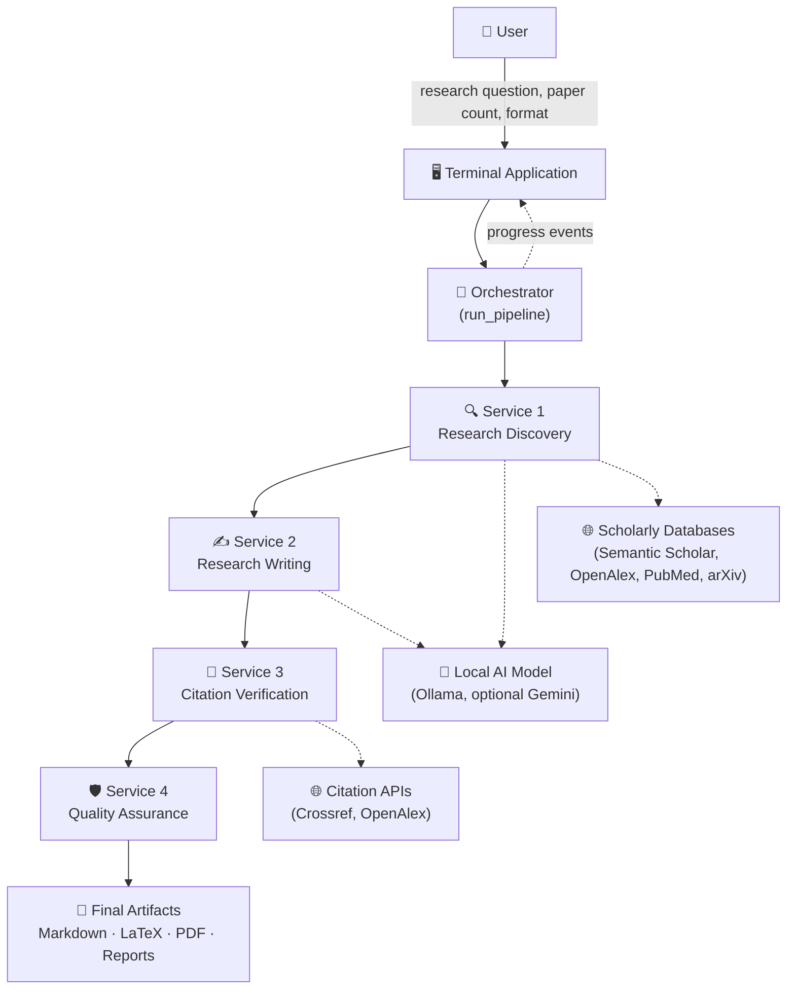

# 🟢 Phase 1 — Foundation & Complete System Vision

**Progress: ~33%**

```
██████████░░░░░░░░░░ 33%
```

---

## 📖 Index

1. [🎯 Project Overview](#-1-project-overview)
2. [❓ Problem Statement](#-2-problem-statement)
3. [💡 Proposed Solution](#-3-proposed-solution)
4. [🏗️ Complete System Architecture](#️-4-complete-system-architecture)
5. [🔄 Complete Pipeline Flow](#-5-complete-pipeline-flow)
6. [🧩 Service Architecture](#-6-service-architecture)
7. [📥 Input Design](#-7-input-design)
8. [📤 Expected Output](#-8-expected-output)
9. [🤖 AI Model Architecture](#-9-ai-model-architecture)
10. [🔗 Service Communication](#-10-service-communication)
11. [📊 Expected Analytics & Evaluation Metrics](#-11-expected-analytics--evaluation-metrics)
12. [⚡ Expected Performance Considerations](#-12-expected-performance-considerations)
13. [🎯 Expected Accuracy/Quality Considerations](#-13-expected-accuracyquality-considerations)
14. [⚙️ What's Already Working in Phase 1](#️-14-whats-already-working-in-phase-1)
15. [🧪 Phase 1 Testing](#-15-phase-1-testing)
16. [🚀 Future Phase Plan](#-16-future-phase-plan)

---

## 🎯 1. Project Overview

**ResearchGenie** is a local-first AI research assistant. It takes one research question and produces an evidence-grounded academic paper draft — automatically discovering relevant literature, identifying genuine research gaps, drafting a citation-backed paper, verifying every reference against real scholarly databases, and independently auditing the result for quality.

Everything runs on the user's own machine by default, using a local AI model — no research data has to leave the device.

## ❓ 2. Problem Statement

Early-stage academic research is slow and fragmented:

- 🔍 Literature search is manual and time-consuming across multiple databases.
- 🧩 Spotting a genuine, novel research gap requires reading and synthesizing many papers.
- ✍️ Drafting an evidence-grounded outline from scratch takes significant effort.
- 🔗 Checking that every citation is real and correctly attributed is easy to skip.
- 📊 There's rarely an independent check on whether the final draft's claims actually match its evidence.

A researcher starting a new project spends disproportionate time on this "getting started" phase before any original thinking can happen.

## 💡 3. Proposed Solution

A single local pipeline that takes a research request and produces a structured, auditable starting point:

- Never presented as a finished or verified paper — always as AI-assisted synthesis for human review.
- Every claim traceable to a real, verified source.
- Every stage's output saved as an artifact, so nothing is a black box.
- Runs entirely on local hardware by default — privacy-preserving, no API costs, no data leaving the machine.

## 🏗️ 4. Complete System Architecture

This is the **complete, final** architecture — Phase 1 implements the foundation and the first service; Phases 2 and 3 build out the rest on top of this same design.



## 🔄 5. Complete Pipeline Flow


## 🧩 6. Service Architecture

The final system is four independent services behind one orchestrator — each testable in isolation, each with a defined input/output contract.

| Service | Responsibility | Status in Phase 1 |
|---|---|---|
| 🔍 Research Discovery | Search, dedupe, rank literature; find gaps and novelty | ✅ Built this phase |
| ✍️ Research Writing | Evidence-grounded outline + draft generation | 🔜 Phase 2 |
| 🔗 Citation Verification | Validate every reference against real databases | 🔜 Phase 2 |
| 🛡️ Quality Assurance | Independent, deterministic audit of the final draft | 🔜 Phase 2 |

## 📥 7. Input Design

A `ResearchRequest` captures everything the pipeline needs:

- 🔬 Research question (required)
- 🎯 Publication type (conference / journal / other)
- 📚 Corpus size (6–9 papers)
- 📄 Target format (IEEE / Springer / ACM / APA / Other)
- 🌐 Domain, year range, preferred databases, keywords, excluded topics (all optional refinements)

## 📤 8. Expected Output

The final product (built out across all three phases) produces, per run:

- 📝 A Markdown research draft
- 📄 LaTeX source, and a compiled PDF where a LaTeX toolchain is available
- 🔗 A verified reference list
- 📊 A quality report and citation validation report
- 🧾 Full run metadata

## 🤖 9. AI Model Architecture

- Every service asks for JSON-schema-constrained completions through one shared provider layer (`shared/utilities/llm_provider.py`) — never talks to a model SDK directly.
- Default provider: a local [Ollama](https://ollama.com) model — no cloud dependency for reasoning.
- This abstraction means the underlying model can be swapped by configuration, not by rewriting service code — a design decision made from day one, which is what let an optional cloud provider be added later (Phase 3) without touching any service's own logic.

## 🔗 10. Service Communication

- Every service is an **async generator**: it yields structured progress events as it works, then a final typed result.
- Services never call each other directly — each one only knows its own Pydantic input/output contract (`shared/contracts/`). This is what makes each service independently buildable and testable.
- The orchestrator (built out in later phases) is the only component that knows the full pipeline order.

## 📊 11. Expected Analytics & Evaluation Metrics

Planned for later phases, once there's a full pipeline to measure:

- 📚 Papers discovered → unique → selected (funnel)
- 🎯 Relevance score distribution of selected papers
- ✍️ Sections successfully drafted vs. planned
- 🔗 Citations verified / invalid / unverifiable
- 📊 Quality scores across four dimensions
- ⏱️ Per-stage and total run time

## ⚡ 12. Expected Performance Considerations

- Running a multi-billion-parameter model locally on consumer hardware (not a cloud GPU cluster) means LLM inference time is expected to be the dominant cost in every stage — this is planned for from the start, not discovered later.
- Context-window sizing, output-length budgets, and model quality/speed tradeoffs will need active management (addressed as real findings in later phases).

## 🎯 13. Expected Accuracy/Quality Considerations

- A small local model is less reliable than a large cloud model at strict instruction-following (e.g., staying within an evidence boundary, matching citation formats exactly) — the system is designed around **deterministic validation** wherever possible, rather than trusting model output at face value.
- Every stage's output is checked in code, not just generated and passed along — a principle carried through the entire project.

## ⚙️ 14. What's Already Working in Phase 1

Phase 1 is not documentation-only. The following is real, running code:

- 📥 **Input foundation** — `shared/contracts/discovery_contract.py` defines the validated request/result shapes.
- 🏗️ **Project foundation** — repository structure, shared utilities, and the local AI provider abstraction.
- 🔎 **Research Discovery Service, fully working end-to-end**:
  - Query generation from a natural-language research question, via the local model.
  - Parallel search across four keyless scholarly databases (Semantic Scholar, OpenAlex, PubMed, arXiv).
  - Deduplication (by DOI and normalized title) and relevance ranking.
  - Full-text retrieval and extraction of Discussion/Limitations/Future-research sections where available.
  - A structured gap-and-novelty analysis report.
- 🤖 **Ollama connection** — real, working request/response flow against a local model (`qwen3.5:9b`), including reliability fixes for structured-output generation on constrained local hardware.
- 📡 **Basic progress events** — the Discovery service already yields real events (`Generating search queries…`, `Found N papers`, `Selected N paper(s)`) as it works, not just a final result.

## 🧪 15. Phase 1 Testing

| Test type | What it covers |
|---|---|
| Unit tests | Contract validation, paper deduplication (by DOI, by normalized title), relevance ranking |
| Integration test | A full live Discovery run against the local model with a real research question |
| Manual verification | A complete live run against "What are the effects of intermittent fasting on cognitive performance?" |

### 📊 Phase 1 Real Results

From a real verification run:

| Metric | Value |
|---|---|
| Papers found (across all sources) | 120 |
| Unique after deduplication | 118 |
| Selected for the corpus | 6 |
| Research gaps identified | 11 |
| Novelty confidence | Medium |

*(These are real numbers from an actual pipeline run recorded during development — not projected estimates.)*

## 🚀 16. Future Phase Plan

- **Phase 2** builds the remaining three services (Writing, Citation Verification, Quality Assurance) and connects all four into one working pipeline.
- **Phase 3** adds the backend API, the polished terminal application, comprehensive reliability testing, and full product packaging (`pip install researchgenie`).
