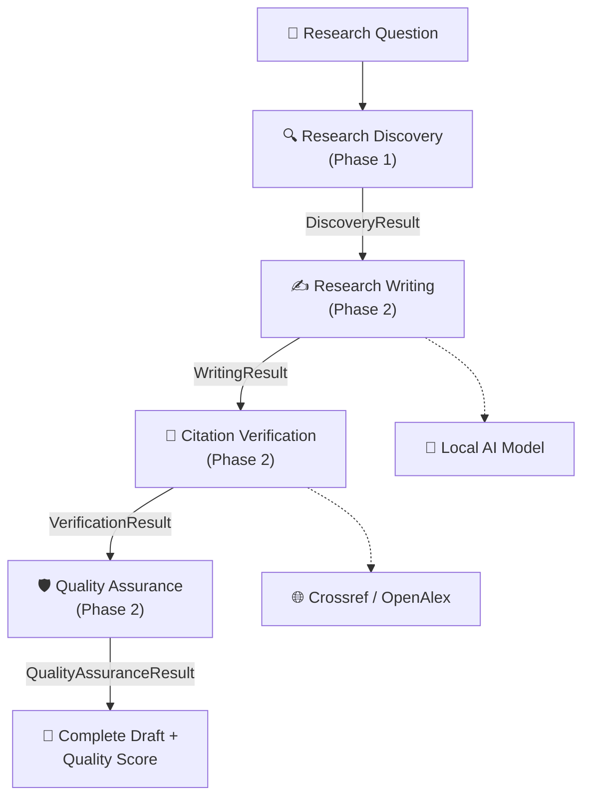
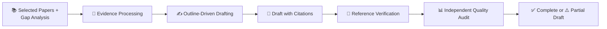

# 🟡 Phase 2 — Core Research Intelligence Pipeline

**Progress: ~66%**

```
████████████████░░░░ 66%
```

---

## 📖 Index

1. [🎯 Phase Objective](#-1-phase-objective)
2. [🏗️ Updated System Architecture](#️-2-updated-system-architecture)
3. [🔄 Pipeline Flow](#-3-pipeline-flow)
4. [🧩 Service Responsibilities](#-4-service-responsibilities)
5. [🔗 Service Communication](#-5-service-communication)
6. [📥 Input → ⚙️ Processing → 📤 Output](#-6-input--️-processing---output)
7. [🤖 AI Architecture](#-7-ai-architecture)
8. [🧪 Testing Performed](#-8-testing-performed)
9. [📊 Results](#-9-results)
10. [🎯 Accuracy / Quality](#-10-accuracy--quality)
11. [⚡ Performance / Throughput](#-11-performance--throughput)
12. [🐛 Problems Found & 🔧 Fixes Applied](#-12-problems-found---fixes-applied)
13. [📈 Analytics](#-13-analytics)
14. [🚀 What Remains for Phase 3](#-14-what-remains-for-phase-3)

---

## 🎯 1. Phase Objective

Build the remaining three services on top of Phase 1's Research Discovery Service, and connect all four into one real, working, end-to-end pipeline — a research question goes in, a complete evidence-grounded draft with verified citations and an independent quality score comes out.

## 🏗️ 2. Updated System Architecture



Each arrow is a Pydantic contract, not a shared mutable object — every service only ever sees the previous stage's finished, validated output.

## 🔄 3. Pipeline Flow



## 🧩 4. Service Responsibilities

| Service | Responsibility |
|---|---|
| ✍️ **Research Writing** | Builds an outline from Discovery's papers and gaps, extracts structured evidence ("literature cards") per paper, writes each section grounded only in that evidence, and assembles a cited draft. |
| 🔗 **Citation Verification** | Extracts the DOI from every rendered reference and checks it against Crossref (primary) then OpenAlex (fallback) — classifies each as verified, invalid, or unverifiable. Never silently repairs a bad reference. |
| 🛡️ **Quality Assurance** | An independent, fully deterministic audit — no LLM calls — checking for uncited high-risk claims, cited claims that don't actually match their source's content, and required-section presence. Produces a 0–5 score across four dimensions. |

## 🔗 5. Service Communication

- Research Writing consumes Discovery's full `DiscoveryResult` — papers, abstracts, gaps, and novelty analysis together.
- Citation Verification consumes only Writing's `WritingResult.reference_candidates` — it never re-reads the draft's prose.
- Quality Assurance is the only stage that needs **all three** prior results together — an independent audit needs the original evidence, the draft, and the citation checks at once, not just the immediately preceding stage's output.

## 📥 6. Input → ⚙️ Processing → 📤 Output

| Stage | Input | Processing | Output |
|---|---|---|---|
| Writing | `DiscoveryResult` | Outline → literature cards → section-by-section drafting | `WritingResult` (draft, references, `draft_status`) |
| Verification | `WritingResult` | DOI extraction → Crossref/OpenAlex lookup | `VerificationResult` (verified/invalid/unverifiable) |
| Quality Assurance | Discovery + Writing + Verification | Deterministic claim/citation/structure checks | `QualityAssuranceResult` (0–5 scores, final draft) |

## 🤖 7. AI Architecture

- Research Writing is the only new service in this phase that calls the local model — and it does so through a dedicated evidence-extraction and section-writing flow, not one giant "write the whole paper" prompt.
- Citation Verification and Quality Assurance make **zero LLM calls** — both are deliberately deterministic. Grading a draft with the same model that wrote it is a weaker independence guarantee than a rule-based check, and this hardware is already the bottleneck for the writing stage.

## 🧪 8. Testing Performed

| Test type | Coverage |
|---|---|
| Unit tests | Outline construction, DOI extraction, citation classification, missing-citation detection, unsupported-claim detection, missing-section detection |
| Live integration tests | Writing against the real local model (minimal case); Verification against real Crossref/OpenAlex with a real DOI, a fabricated DOI, and a DOI-less reference |
| Full pipeline (manual + automated) | All four services chained end-to-end, twice — once by hand, once through the newly-built orchestrator |

## 📊 9. Results

Real results from live runs recorded during this phase:

| Run | Overall QA Score | Notes |
|---|---|---|
| Run A | 3.5 / 5.0 | Fewer citations verified in this run |
| Run B | 4.2 / 5.0 | More complete citation coverage |

The score correctly tracked each run's actual citation completeness rather than being a fixed number — direct evidence the scoring logic responds to real input, not a constant.

## 🎯 10. Accuracy / Quality

A real structural bug was found and fixed in this phase (see §12) that, before the fix, guaranteed near-total section failure on a full-size outline. After the fix, a re-verification run confirmed the guaranteed-failure pattern was gone, though per-section reliability on this hardware remained a known, ongoing limitation carried into Phase 3 for a dedicated reliability pass.

## ⚡ 11. Performance / Throughput

Real timings from a full-corpus verification run:

| Stage | Time |
|---|---|
| Discovery | ~245s |
| Writing | ~681s |
| **Total (Discovery + Writing)** | **~15.4 minutes** |

Verification and Quality Assurance are fast by design (network lookups and pure Python respectively) — the LLM-calling stages dominate total runtime, exactly as anticipated in Phase 1's architecture notes.

## 🐛 12. Problems Found & 🔧 Fixes Applied

| Problem | Root Cause | Fix |
|---|---|---|
| Near-total section failure on a full outline | Per-research-gap literature-review subsections made the writing pipeline's own evidence-tagging step correctly (but too aggressively) exclude almost the whole corpus per subsection | Flattened the outline to Introduction / Literature Review / Limitations / Conclusion; render Discovery's own gap/novelty synthesis directly instead of re-evidencing it |
| Discovery relevance edge case | One run selected an unrelated paper for an on-topic query | Identified and documented; the full fix was completed in Phase 3 |

## 📈 13. Analytics

- Discovery → Writing → Verification → Quality Assurance chained successfully across multiple real runs with varying citation counts.
- Citation Verification's DOI-extraction pattern confirmed working against Writing's real IEEE-formatted reference strings — a genuine cross-service format compatibility check, not assumed.

## 🚀 14. What Remains for Phase 3

- A real backend API (not just an importable pipeline function).
- A polished terminal application as the primary user interface.
- Dedicated reliability passes for both Discovery's relevance selection and Writing's per-section completion rate.
- Full packaging so the project installs and runs as a real product (`pip install researchgenie`).
