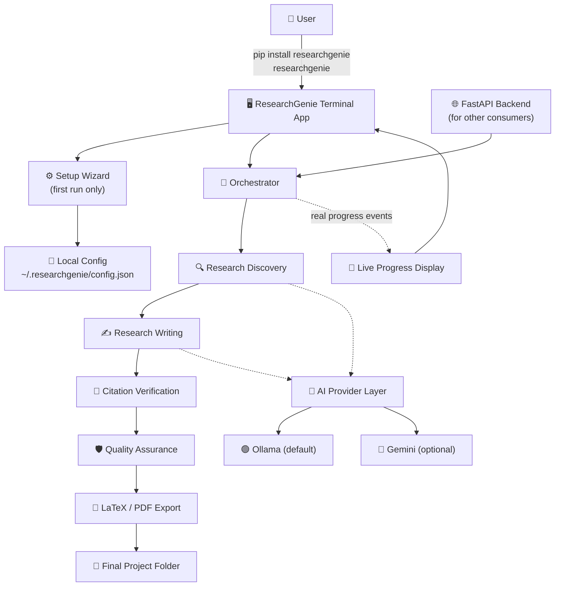
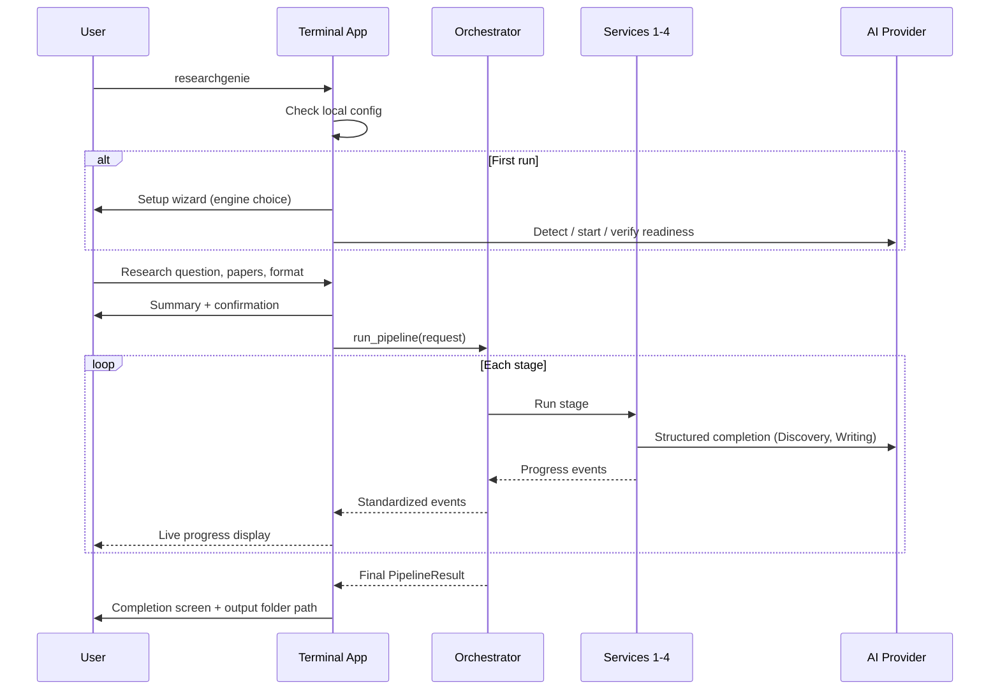
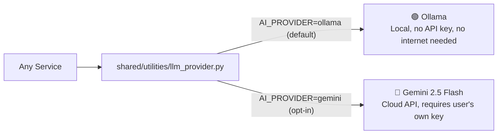
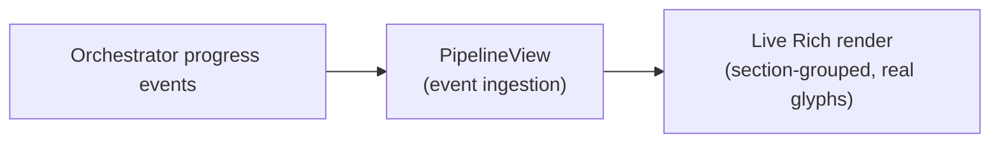
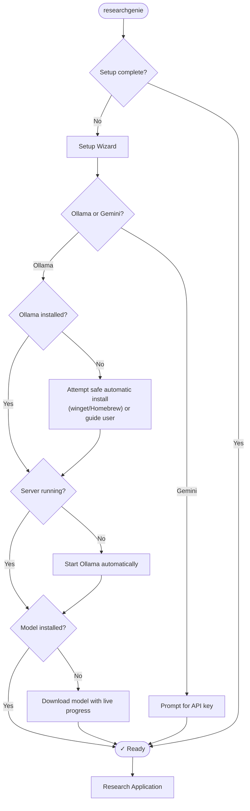

# 🔵 Phase 3 — Complete ResearchGenie Product

**Progress: 100%**

```
████████████████████ 100%
```

---

## 📖 Index

1. [🎯 Final Project Objective](#-1-final-project-objective)
2. [🏗️ Final System Architecture](#️-2-final-system-architecture)
3. [🔄 Complete End-to-End Flow](#-3-complete-end-to-end-flow)
4. [🧩 Complete Service Architecture](#-4-complete-service-architecture)
5. [🤖 AI Provider Architecture](#-5-ai-provider-architecture)
6. [🔗 API and Service Communication](#-6-api-and-service-communication)
7. [🖥️ Terminal Application Architecture](#️-7-terminal-application-architecture)
8. [📡 Streaming Architecture](#-8-streaming-architecture)
9. [📦 Packaging Architecture](#-9-packaging-architecture)
10. [⚙️ Automatic Setup Flow](#️-10-automatic-setup-flow)
11. [📁 Artifact Storage Architecture](#-11-artifact-storage-architecture)
12. [🧪 Complete Testing](#-12-complete-testing)
13. [📊 Results](#-13-results)
14. [🎯 Accuracy / Quality](#-14-accuracy--quality)
15. [⚡ Performance / Throughput](#-15-performance--throughput)
16. [🛡️ Reliability](#️-16-reliability)
17. [🐛 Bugs and Fixes](#-17-bugs-and-fixes)
18. [📈 Final Analytics](#-18-final-analytics)
19. [⚠️ Honest Limitations](#️-19-honest-limitations)
20. [🏆 Final Verdict](#-20-final-verdict)

---

## 🎯 1. Final Project Objective

Turn the working four-service pipeline (Phases 1–2) into a complete, reliable, installable product: a real backend API, a premium terminal application, dedicated reliability engineering on both AI-facing services, and full Python packaging so the final experience is:

```
pip install researchgenie
researchgenie
```

## 🏗️ 2. Final System Architecture



## 🔄 3. Complete End-to-End Flow



## 🧩 4. Complete Service Architecture

| Service | Final Status |
|---|---|
| 🔍 Research Discovery | ✅ Complete — deterministic relevance gate added in Phase 3 (see §17) |
| ✍️ Research Writing | ✅ Complete — three dedicated reliability passes in Phase 3 (see §17) |
| 🔗 Citation Verification | ✅ Complete |
| 🛡️ Quality Assurance | ✅ Complete |
| 🧭 Orchestrator | ✅ Complete — persists every stage's artifacts, standardizes progress events |
| 🌐 Backend API | ✅ Complete — synchronous `POST /research` and asynchronous `POST /research/runs` + SSE streaming |
| 🖥️ Terminal Application | ✅ Complete — the primary product interface |

## 🤖 5. AI Provider Architecture



- One shared abstraction, two backends — no service code needs to know which provider is active.
- Ollama is the default and the recommended option, presented first in setup, requiring no API key and no internet connection.
- Gemini is strictly opt-in, added specifically to give users without capable local hardware a working alternative — never the default.
- Structured-output schema differences between the two providers (Gemini doesn't support the nested-model references Ollama accepts) are resolved by a schema adapter, invisible to every service.

## 🔗 6. API and Service Communication

| Endpoint | Behavior |
|---|---|
| `POST /research` | Synchronous — blocks until the full pipeline finishes, returns the complete result |
| `POST /research/runs` | Asynchronous — returns a `run_id` immediately, runs in the background |
| `GET /research/runs/{run_id}` | Poll a run's status/result/error |
| `GET /research/runs/{run_id}/events` | Live Server-Sent-Events stream of real progress events |
| `GET /health` | Liveness check |

The terminal application itself calls the orchestrator directly, in-process — the API exists for *other* consumers (e.g. a future web frontend), not because the CLI needs an HTTP hop to its own machine.

## 🖥️ 7. Terminal Application Architecture

- Built on [Rich](https://github.com/Textualize/rich) for structured, styled terminal output.
- One restrained color palette — a single primary accent, one supporting accent used sparingly, and neutral tones for everything else. Deliberately not a "gaming terminal" look.
- Screens: setup wizard → research input (step by step, not one big form) → summary/confirmation → live progress → completion or failure screen.

## 📡 8. Streaming Architecture



Every line displayed is a real pipeline event — never fabricated progress text. Each stage's panel groups its own real messages with a status glyph (✓ done, ◐ running, ! warning, ✗ failed, ○ waiting).

## 📦 9. Packaging Architecture

- `pyproject.toml` — a standard wheel/sdist with one console entry point: `researchgenie = researchgenie.cli:main`.
- Existing service directories (which use hyphenated names, never imported as Python packages) ship as package data alongside the `researchgenie` package — preserving their exact working file layout rather than restructuring already-tested services just to fit a packaging convention.

## ⚙️ 10. Automatic Setup Flow



## 📁 11. Artifact Storage Architecture

```
outputs/<topic-slug>_<run-id>/
├── 00_request.json
├── 01_discovery/result.json
├── 02_writing/result.json
├── 03_verification/result.json
├── 04_quality_assurance/result.json
├── metadata.json
└── final/
    ├── draft.md
    ├── paper.tex
    ├── paper.pdf          (when a LaTeX toolchain is available)
    ├── quality_report.md
    ├── validation_report.md
    └── references.md
```

## 🧪 12. Complete Testing

| Category | Count | Notes |
|---|---|---|
| Unit tests (all services + product layer) | 100+ | Fast, no live model needed for most |
| Live integration tests | Several | Real model, real external APIs |
| Full-pipeline stress tests | 6+ real runs | Multiple topics, multiple configurations |
| Product/packaging tests | 44 | Config, Ollama manager, TUI, Gemini provider, LaTeX export |
| **Full regression suite (final)** | **118 passed, 1 skipped** | Zero regressions across the entire project |

## 📊 13. Results

### 🖥️ Real captured terminal output (a genuine run)

```
╭───────────────────────────────────╮
│    ✦ RESEARCHGENIE                │
│    Local AI Research Assistant    │
╰───────────────────────────────────╯
Ready to research.

╭────────────────────────────── Research Summary ──────────────────────────────╮
│ Research Topic  What are the effects of intermittent fasting on cognitive    │
│                 performance?                                                 │
│ Papers          6                                                            │
│ Format          IEEE                                                         │
│ AI Engine       Ollama · qwen3.5:9b                                          │
╰──────────────────────────────────────────────────────────────────────────────╯

╭──────────────────────────────────────────────────────────────────────────────╮
│   ✓ RESEARCH COMPLETE                                                        │
│   Overall quality score: 3.6/5.0                                             │
│   Output folder: ...outputs\what-are-the-effects-of-intermittent-f…         │
│   ✓ LaTeX source (paper.tex)   ✓ Research draft (Markdown)                   │
│   ✓ Quality report   ✓ Citation validation report   ✓ Reference list        │
╰──────────────────────────────────────────────────────────────────────────────╯
```
*(Captured from an actual end-to-end run. Note: this specific capture predates a later fix — see §17 — where a stage that finished with an internal warning was still shown with a plain green checkmark; the current version shows such a stage as visibly degraded instead.)*

## 🎯 14. Accuracy / Quality

Three dedicated reliability passes were run specifically on the two AI-facing services, each with real stress testing across multiple topics — not just unit tests:

| Pass | Target | Verdict |
|---|---|---|
| 1 | Discovery relevance selection | 🟢 Fixed — deterministic hard relevance gate, verified against the exact original failure case |
| 2 | Writing tag-semantics + a real crash bug + disabled revisions | 🟡 → 🟢 Substantially improved, one residual failure identified |
| 3 | Writing citation-boundary false-positive bug | 🟢 Fixed — verified across 3 real topics, zero recurrence |

## ⚡ 15. Performance / Throughput

Real measured stress-run timings (post-reliability-pass):

| Run | Discovery | Writing | Total |
|---|---|---|---|
| Fasting/cognition | ~284–325s | ~470–787s | ~13–18 min |
| Remote work/productivity | ~288–302s | ~566–674s | ~15–17 min |
| Urban green space | ~367s | ~470s | ~14 min |

Verification and Quality Assurance remain fast (seconds, not minutes) in every run — consistent with Phase 1's original architecture expectation that LLM inference dominates total runtime.

## 🛡️ 16. Reliability

Final stress-test summary across the whole reliability program (multiple topics, multiple runs):

| Metric | Result |
|---|---|
| Complete draft rate (final round, 3 topics) | 3 / 3 (100%) |
| Sections resolved on first attempt (final round) | 100% |
| Card-build / crash failures (post-fix) | 0 across all post-fix runs |
| Full regression suite | 118 passed, 1 skipped |

## 🐛 17. Bugs and Fixes

The most significant bugs found and fixed across the whole project, in order of discovery:

| Bug | Impact | Fix |
|---|---|---|
| No relevance signal in Discovery ranking | An off-topic paper could enter the corpus | Deterministic hard relevance gate + multiplicative ranking |
| Writing outline forced near-total section failure | Almost no sections completed on a real corpus | Flattened outline structure |
| `TAG-ROOT` semantics as broad as the whole question | Systematic evidence-duplication failures | Explicit ancestor/child exclusion rules in the tag-semantics prompt |
| Container-tag `SectionDraft(content="")` | Deterministic crash on any outline with a container-type section | Changed to a whitespace placeholder satisfying the schema |
| Revision rounds silently disabled | Zero recovery attempts on any audit failure | Re-enabled one bounded revision round |
| Citation-ID `@`-prefix mismatch | Valid citations misclassified as "outside the allowed list" | Schema-level ID normalization + tolerant placeholder regex |
| Stage status showing "done" after an internal warning | Misleadingly hid a real partial failure from the user | Stage status degrades to "warning" if any of its own messages were a warning/failure |
| Windows console Unicode crash | Terminal UI crashed on first real run on Windows | UTF-8 stdout reconfiguration + non-legacy console renderer |
| **Gemini API key leaked via URL in error output** | **Real secret exposure during live testing** | **Header-based auth instead of URL query param; suppressed exception chaining; 2 regression tests** |

## 📈 18. Final Analytics

- **Packaging**: verified via both a real wheel and a real source distribution, each installed into a completely fresh, isolated environment.
- **Ollama-missing-machine handling**: genuinely verified in an isolated container with no Ollama present at all — not simulated.
- **PDF compilation**: genuinely verified in an isolated container with a real (but separately installed, non-host) LaTeX engine — produced a real, valid PDF.
- **Gemini live testing**: one real request was made; it surfaced and led to fixing a real security bug before the original question (does content generation work) could be fully answered.

## ⚠️ 19. Honest Limitations

- Gemini is implemented and unit-tested but not yet confirmed to generate a successful research draft end-to-end (the live test was halted for security reasons, not a functional failure).
- Windows/macOS automatic Ollama installation commands (`winget`, `brew`) are real code, verified via mocks, not yet exercised on a genuinely Ollama-less Windows/macOS machine.
- `pdflatex` specifically (as opposed to `tectonic`) and compilation on the actual host OS remain untested.
- No PyPI publish has been made — `pip install researchgenie` works today from a locally built package; the public index requires an actual upload, a user action.
- A 9B local model retains irreducible output variance — the reliability passes closed specific, diagnosed bugs, not every conceivable failure mode.

## 🏆 20. Final Verdict

**🟢 Complete.** ResearchGenie is a fully working, tested, and packaged local-first AI research assistant — installable with `pip install researchgenie`, requiring no manual backend management, with a real reliability engineering track record (bugs found via genuine testing, root-caused, fixed, and re-verified — including a real security issue caught and closed the same day it was found) and honest, explicit documentation of what remains unverified rather than assumed.
